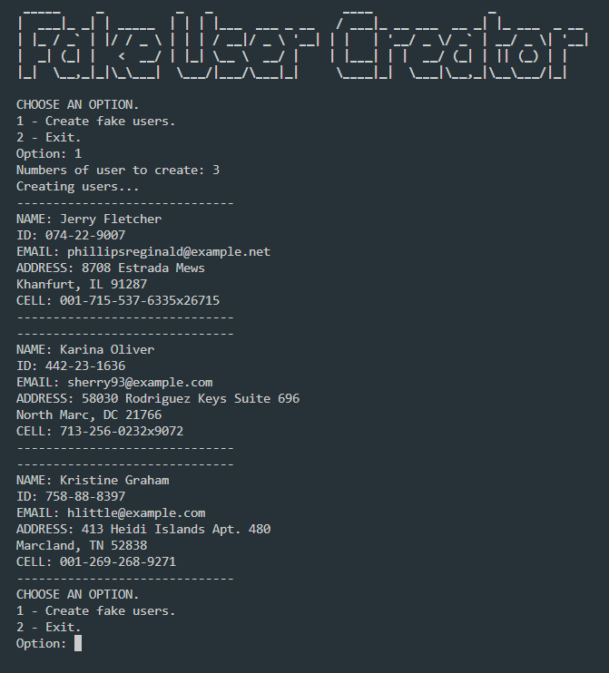

# Fake User Creator
Fake User Creator helps you to create fake information for testing your database.
You can easily gather fake data to populate any system.

# Features
Creates fake names, addresses, IDs and phone numbers.

# Technology
Python with Faker.

# How to use
Fake User Creator quick and simple, you just need to run the app and choose between options to have fake user's data created.
Run the Fake User Creator and choose option 1 to start, then type the number of users you want create.

